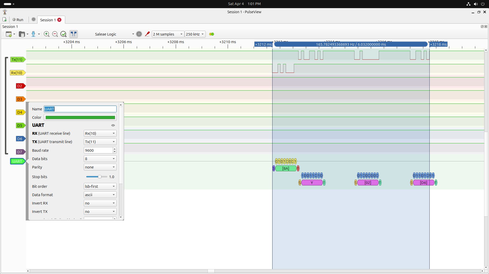
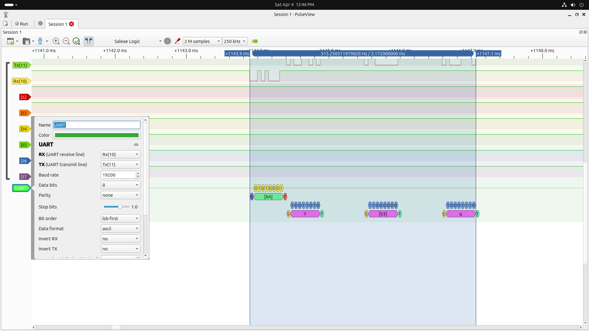
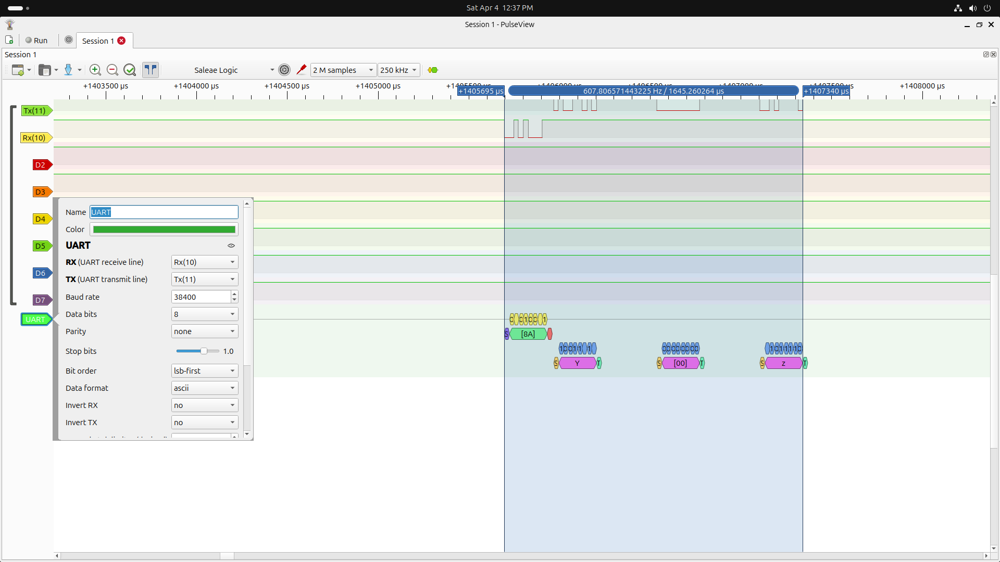
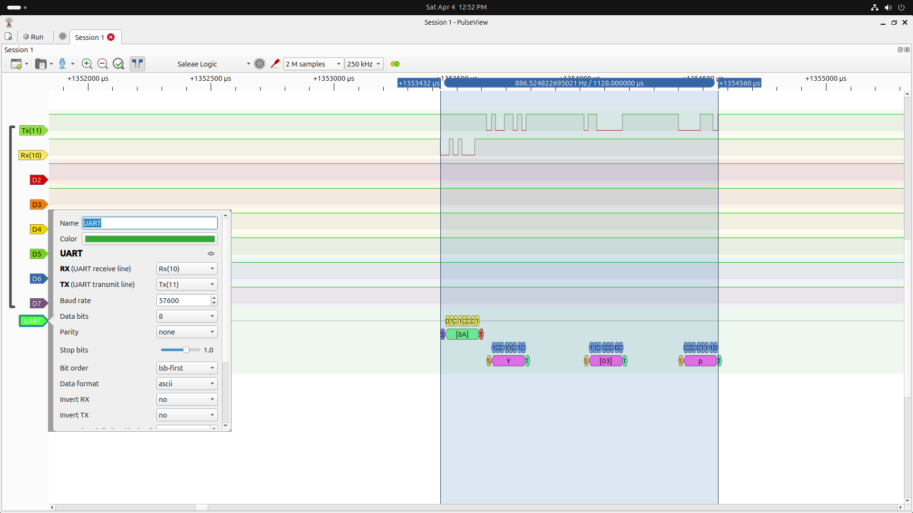
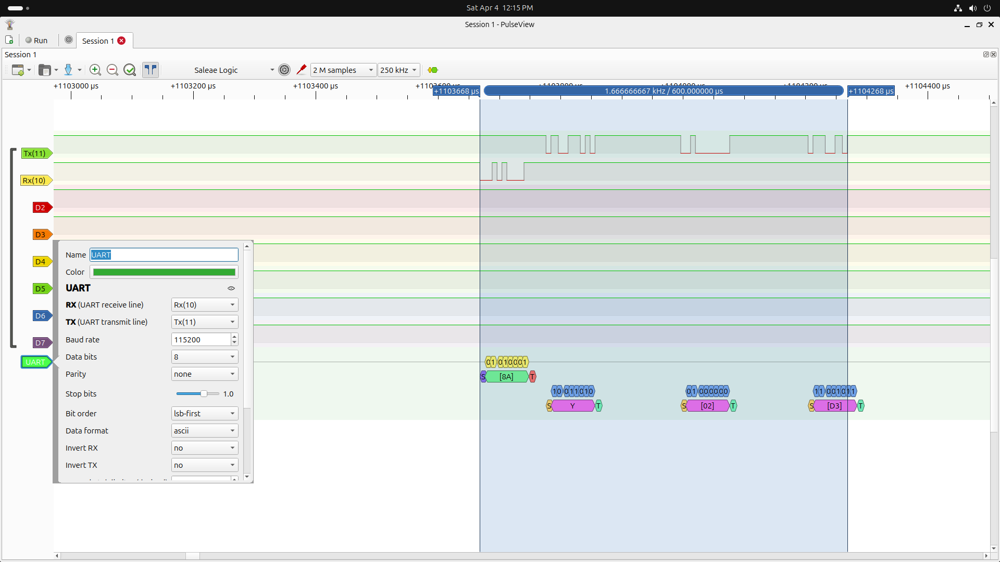

# Custom RS-485 D-Bit Protocol for ESP32 & Arduino

A lightweight, robust, and self-synchronizing custom RS-485 master-slave communication protocol designed specifically for embedded microcontrollers. 

## 📡 Protocol Specification

This protocol operates on a unique "D-bit" payload structure that eliminates the need for hardcoded byte counts, allowing slave devices to self-synchronize dynamically.

### Command Byte Structure (Master → Slaves)
Every transaction begins with a single command byte broadcasted by the master device, configured as follows:
*   **Bit 7 (Data Width):** `1` indicates a 16-bit transfer, `0` indicates an 8-bit transfer[cite: 1].
*   **Bits 6-4 (Register Address):** Targets a specific register from `0` to `7`, allowing up to 8 registers per slave[cite: 1].
*   **Bit 3 (Operation):** `1` signifies a Read operation, `0` signifies a Write operation[cite: 1].
*   **Bits 2-0 (Slave ID):** Targets a specific slave address from `1` to `7`[cite: 1].

### Handshake & The "DEAF" State
*   **Targeted Slave:** Upon receiving a command byte addressed to its ID, the slave replies with an ASCII `Y` character before handling the read request or waiting for incoming write data[cite: 1].
*   **Non-Targeted Slaves:** All other slaves on the bus instantly enter a `DEAF` state[cite: 1]. While in this state, they monitor the highest bit (the D-bit) of every incoming byte on the bus[cite: 1]. They return to their `IDLE` state only when they detect a byte with the D-bit set to `1`, signaling the end of the current transaction[cite: 1].

### Data Byte Format (D-Bit Protocol)
To ensure the `DEAF` slaves know when a transaction ends, actual data payloads are chunked into 7-bit blocks. The 8th bit (Bit 7) acts as the Data-bit (D-bit):
*   `0` = More data bytes follow[cite: 1].
*   `1` = This is the final byte of the transaction[cite: 1].

**Encoding Breakdown:**
*   **8-bit Value:** Requires 2 data bytes on the bus (1 bit in the first byte, 7 bits in the second byte)[cite: 1].
*   **16-bit Value:** Requires 3 data bytes on the bus to perfectly pack the 16 bits (2 MSBs in the first byte, 7 bits in the second, and 7 bits in the final byte)[cite: 1].

---

## 💻 Code Structure

### 1. Protocol Header (`Custom_RS_485.h`)
The core state machine and logic are encapsulated in `Custom_RS_485.h`. It includes built-in encoding/decoding helpers and handles the RS-485 Read Enable/Data Enable (RE/DE) pin toggling automatically[cite: 1].

### 2. Interrupt-Driven ESP32 Implementation (`Custome_RS485_ESP32_ArduinoIDE.ino`)
To ensure high performance and prevent blocking the main loop, the ESP32 implementation avoids traditional polling. 
*   It utilizes the ESP32's `Serial2.onReceive()` function to attach a hardware interrupt callback[cite: 2].
*   The `onRs485Receive()` callback rapidly drains the hardware buffer into the `slave_process()` state machine[cite: 2]. 
*   This leaves your `loop()` completely free to handle other tasks![cite: 2].

---

## 🔍 Logic Analyzer Captures

Below are PulseView logic analyzer screenshots validating the custom protocol's timing and handshake sequences across various baud rates. 

| Baud Rate | Capture 1 |
| :--- | :--- |
| **9600** |  |
| **19200** |  |
| **38400** |  |
| **57600** |  |
| **115200** |  |

---

*Author: Prem Kumar S*
